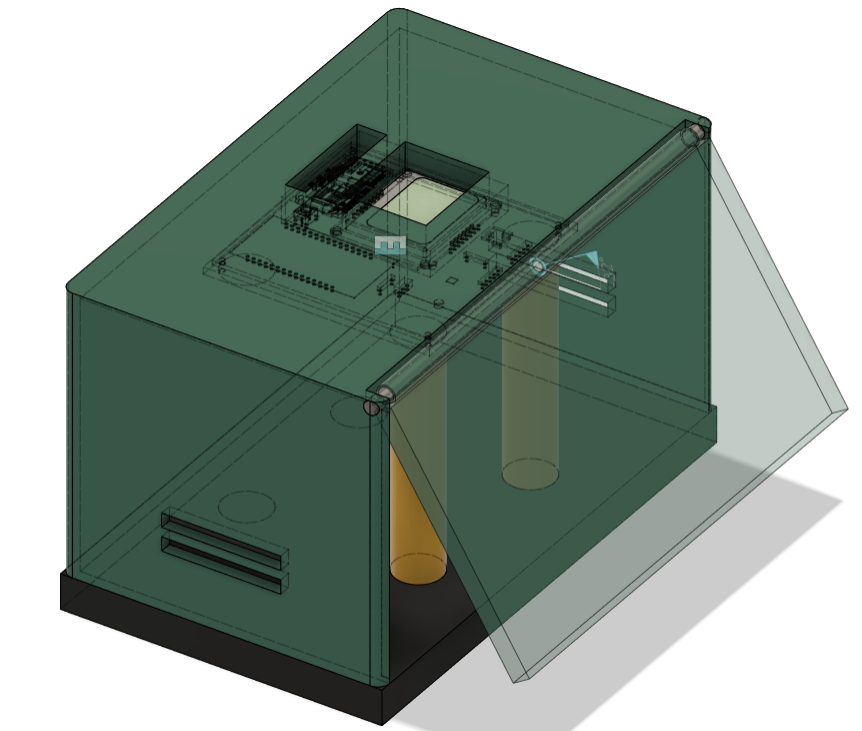
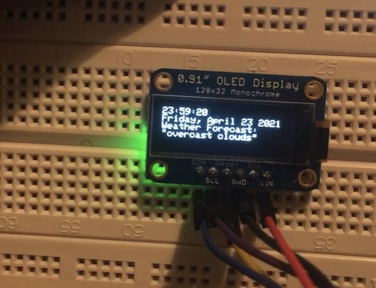

# Air Quality Monitoring System
This repository includes the Arduino C code (monitoring_arduinoC.ino) for the air quality monitoring system. To be used with the ESP32 microcontroller, a BME680 sensor, a push button for input, and an Adafruit 128x32 OLED.  
\
 
\
Below shows the Adafruit display on the breadboard prototype with the system working as expected.
 
\
The circuit schematics and PCB for the system can be found in the circuit_files folder.  
The CAD folder contains the 3D design of the monitoring system housing. Fusion 360 is needed to open the .fz3 file.  
\
Also included is the HTML file (monitoring_webserver.html) to build the web server with the ESP32.  
To build the server: 
1. Download the Monitoring_Code folder
2. Open the project using Ardunio
3. Upload the sketch to the ESP32 and run it
4. Open the serial monitor and use obtain the ESP32's IP address
5. Enter IP address into web browser 
